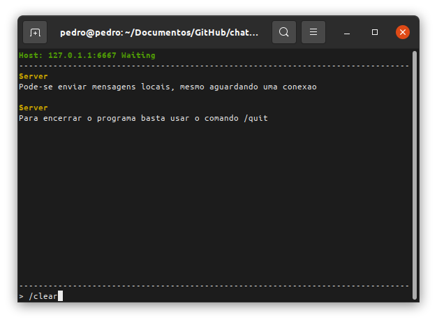
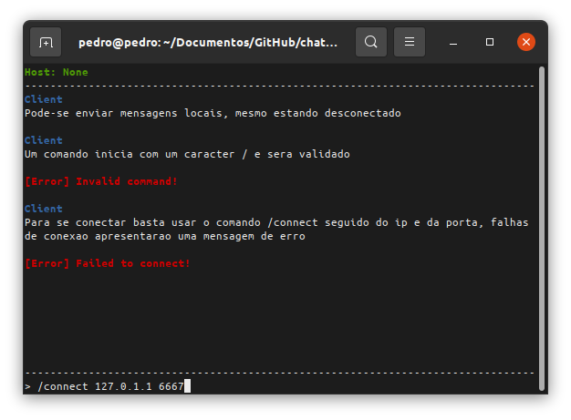
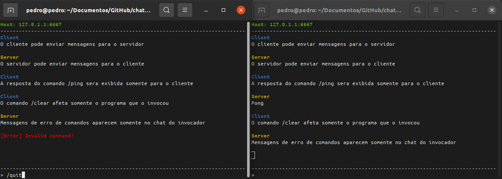

# Internet Relay Chat

**SSC0142 - Redes de Computadores** 

- Matheus Ventura de Sousa         - 11345541
- Gustavo Henrique Brunelli        - 11801053
- Pedro Lucas de Moliner de Castro - 11795784

> Este trabalho está disponível, também, no [GitHub](https://github.com/pedrolmcastro/chat).


### Dependências

O projeto foi construído na linguagem **C++ 11**, compilado com **g++** e **Makefile** em um sistema operacional **Ubuntu 20.04** e utiliza as bibliotecas netdb.h, fcntl.h, unistd.h, arpa/inet.h, sys/socket.h e netinet/in.h dependentes do sistema operacional para implementação dos sockets, além da ncurses.h para manipulação do terminal.

```
sudo apt install g++
sudo apt install make
sudo apt install libncurses-dev
```


### Compilação e Execução

Para compilar o Módulo 1 deste trabalho, basta entrar no diretório **Modulo 1/** e invocar a diretiva `make`, ao fim de sua execução será possível notar o aparecimento dos arquivos executáveis **client/client.out** e **server/server.out**.

```
cd Modulo/\ 1/
make
```

Para executar o Cliente, basta rodar o comando `make client` e, similarmente, para rodar um Servidor a diretiva `make server` é utilizada. Recomenda-se a utilização de dois terminais separados para melhor visualização da interação entre os programas.


## Utilização

Um **Servidor** ao ser inicilizado fica aguardando a recepção de um **Cliente**, este pode se conectar utilizando o /connect que, em caso de sucesso, iniciará um chat entre os programas. É possível enviar mensagens de qualquer tamanho (sendo possivelmente divida em partes menores para transmissão) ou invocar comandos com o caracter **/**. Para encerrar a comunicação basta usar /quit em qualquer um dos participantes.

Comando           | Função
:---------------- | :-----------------------------------------------------
/connect IP PORTA | Estabele conexão com o servidor ouvindo em IP:PORTA
/clear            | Limpa a janela de chat local
/ping             | Solicita que o servidor responda "Pong"
/quit             | Encerra a execução local e remota se estiver conectado





> **Nota:** É possível que o Servidor imprima em seu cabeçalho de IP o localhost 127.X.X.X como no exemplo acima, nesses casos ainda é possível se conectar a ele de outra máquina, mas o IP deve ser descoberto por outras ferramentas como ifconfig, o grupo tentará corrigir essa falha para a entrega seguinte.

> **Nota:** A impressão de mensagens muito longas em janelas de terminais pequenas pode bagunçar o funcionamento da biblioteca ncurses.h, mas basta aumentar o tamanho da janela e resetar o programa que será possível vizualizar as mensagens corretamente, inclusive sua segmentação em partes no caso de passar do tamanho limite estabelecido.


## Implementação

Os sockets foram transformados em **não bloqueantes** para que fosse possível utilizar múltiplas **threads** mais facilmente. Na implementação aplicada, após a conexão, tanto o Servidor quanto o Cliente terão duas threads, uma chamada **sender** que recebe o input do teclado e envia a mensagem ou executa o comando digitado e a outra nomeada **receiver** que ouve por mensagens no socket e executa a ação apropriada sobre elas. O controle de execução dessas threads é feito por uma **variável atômica** booleana identificada por **execution** e, como a impressão dos dados na tela pode ter conflito com acessos simultâneos, o terminal é controlado por um **mutex**. A codificação das mensagens em streams de 4096 bytes é a seguinte:

Cor | Apelido + \0 | Menssagem + \0
:-: | :----------: | :------------:
0   | 1 - 21       | 22 - 4095
